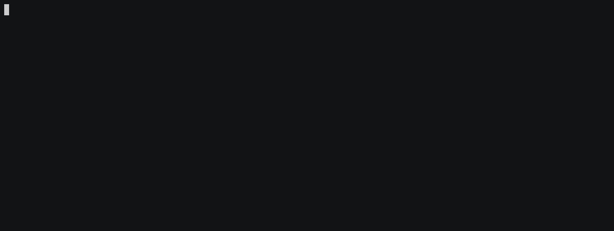

```

     _/_/_/  _/                                  _/
  _/        _/_/_/      _/_/    _/  _/_/    _/_/_/
 _/        _/    _/  _/    _/  _/_/      _/    _/
_/        _/    _/  _/    _/  _/        _/    _/
 _/_/_/  _/    _/    _/_/    _/          _/_/_/


```

[](https://circleci.com/gh/winternet/chord) [](https://codecov.io/gh/winternet/chord)

## Overview

This is an experimental layered distributed peer to peer overlay filesystem based on distributed hashtables (DHTs). The implementation is heavily based on the paper ["Chord: A Scalable Peer-to-peer Lookup Protocol for Internet Applications"](https://pdos.csail.mit.edu/papers/ton:chord/paper-ton.pdf) by Ion Stoica et al. See [Wikipedia](<https://en.wikipedia.org/wiki/Chord_(peer-to-peer)>) for more information.


## Fuse Adapter

The project comes with an optional, incomplete and even more experimental adapter for fuse (c.f. [libfuse](https://github.com/libfuse/libfuse/)) to mount the distributed filesystem:



## Installation

The easiest way to get started with chord is using a small docker image (~8 MB) built from scratch provided by the repository `winternet1337/chord`. The images are automatically built and pushed to docker hub after each commit - provided all tests passed successfully. To pull the image issue

```sh
$ docker pull winternet1337/chord:latest
```

See [INSTALL.md](INSTALL.md) for more detailed installation instructions, e.g. how to build the project from sources.

## Usage

To run a node in interactive mode and cleanup automatically afterwards issue `$ docker run -ti --rm winternet1337/chord`. This command will bootstrap the container with random node uuid on default port `50050`. To stop the container issue `Ctrl+C`.

In order to print chord's help just append the `--help` argument (`-h` for short):

```sh
 $ docker run -ti --rm winternet1337/chord --help
 [program options]:
  -h [ --help ]           produce help message
  -c [ --config ] arg     path to the yaml configuration file.
  -j [ --join ] arg       join to an existing address.
  -b [ --bootstrap ]      bootstrap peer to create a new chord ring.
  -n [ --no-controller ]  do not start the controller.
  -u [ --uuid ] arg       client uuid.
  --bind arg              bind address that is promoted to clients.
```

To configure our node we could pass some of the arguments to the container, however, it is far more convenient and powerful to use a configuration file. For this to work, we create one on our docker host machine and mount the volume within the docker container.

### The node configuration

Sample configurations can be found in the sourcecode repository under the [config](https://github.com/winternet/chord/tree/main/config)-folder. Either use this samples or copy & paste the one below to e.g. /tmp/chord/config/node0.yml:

```yaml
version: 1

## data
data-directory: "/data"
meta-directory: "/meta"

## networking
bind-addr: "0.0.0.0:50050"
join-addr: "0.0.0.0:50051"
bootstrap: Yes
no-controller: No

## details
stabilize_ms: 10000
check_ms: 10000

## replication / striping
replication-count: 1

uuid: "0"

## logging
logging:
  level: trace
  sinks:
    CONSOLE_SINK:
      type: "console"
    FILE_SINK:
      type: "file-rotating"
      path: "/logs/chord0.log"
  loggers:
    CHORD_LOG:
      sinks: [FILE_SINK]
      filter: "^chord[.](?!fs)"
    CHORD_FS_LOG:
      sinks: [CONSOLE_SINK]
      filter: "^chord[.]fs"
      level: trace
```

The configuration should be quite self-explanatory. A more detailed description of the configuration will be provided in the wiki.

### Starting configured node

To start the node with the yaml configuration file, we need to mount it to the container.

```sh
 $ docker run -ti --rm \
        -v /tmp/chord/config:/etc/chord \
        winternet1337/chord -c /etc/chord/node0.yml
[<timestamp>] [chord.fs.metadata.manager] [trace] [ADD] chord:///
[<timestamp>] [chord.fs.metadata.manager] [trace] [ADD] .
```

Since we restricted the console logging to the filesystem part, we are greeted by the metadata manager creating the root of our p2p filesystem - waiting for something to happen.

### Setup chord cluster

The next section describes how to setup a small local cluster consisting of two nodes. The section closes with storing a folder within our cluster.

#### Forwarding ports and bind address

To wire our different nodes locally we will exploit docker's `--net=host` option. Note that this is not the preferred way but its ok for showing the basic concepts. We start by mounting more volumes so that all (meta-)data is written to the docker host filesystem.

```sh
 $ docker run -ti --rm --net=host \
        -v /tmp/chord/config:/etc/chord \
        -v /tmp/chord/data0:/data \
        -v /tmp/chord/meta0:/meta \
        -v /tmp/chord/logs0:/logs \
        winternet1337/chord -c /etc/chord/node0.yml
```

Copy the `/tmp/chord/config/node0.yml` to `/tmp/chord/config/node1.yml` and change the uuid to a value near `(2^256)/2` so that all files are distributed equally across the cluster. Also change the bind address to `bind-addr: "0.0.0.0:50051"` and the join address to `join-addr: "0.0.0.0:50050"`.

On a different shell start another docker instance with our second configuration and different (meta-)data directories.

```sh
 $ docker run -ti --rm --net=host \
        -v /tmp/chord/config:/etc/chord \
        -v /tmp/chord/data1:/data \
        -v /tmp/chord/meta1:/meta \
        -v /tmp/chord/logs1:/logs \
        winternet1337/chord -c /etc/chord/node1.yml
```

After a few seconds the nodes should synchronise and build a small cluster. To query the root of the distributed filesystem `chord:///`:

```sh
$ docker run -ti --rm --net=host winternet1337/chord dir chord:///
d---------   .
```

To upload new files to the distributed filesystem issue a `put <node_local> chord:///` command. Examining the root afterwards reveals that a new directory `/etc` has been added.

```sh
$ docker run -ti --rm --net=host winternet1337/chord put /etc chord:///
$ docker run -ti --rm --net=host winternet1337/chord dir chord:///
d---------   .
d---------   etc
$ docker run -ti --rm --net=host winternet1337/chord dir chord:///etc
d---------   .
-rwxrwxrwx   hostname
-rwxrwxrwx   hosts
```

Note that the put commands are currently always sent to `127.0.0.1:50050` and issued locally on that node, i.e. the files on the node are uploaded since only nodes participating in the cluster can upload their directories and files.

Since the (meta-)data directories are mounted on the host filesystem the files hosted on the DHT are inside host's `/tmp/chord/data?` directories. The database storing the metadata is located under `/tmp/chord/meta?`.
